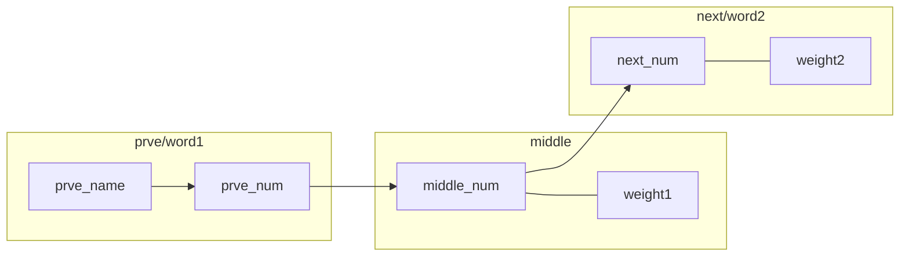

# Software_Engineering-HIT2024Fall

软件工程-2024秋季-刘铭班

笔者选用的cpp，但推荐使用Java

因为Lab3要做测试，老的评审工具checkstyle等都是基于java的

另，**由不当使用此项目造成的课业危险由使用者自行承担！！笔者不负任何责任！！** 😇

- [Lab1](#Lab 1：结对编程与Git实战)
    - [Input](#Input)
    - [Make_Graph](#Make_Graph)
    - [Show_Graph](#Show_Graph)
        - [关于Graphviz](#关于Graphviz)
    - [Bridge_Words](#Bridge_Words)
    - [Generate_Text](#Generate_Text)
    - [Shortest_Path](#Shortest_Path)
    - [Random_Walk](#Random_Walk)
- [迭代](#重大迭代)
  
## Lab 1：结对编程与Git实战

如果能找到平替就无所谓了，或者Lab3再用Java写一份

**本实验的数据结构写的非常抽象**，请斟酌使用😅

### Input

在`read.cpp`中实现，其余全部功能都在`graph，cpp`中实现

用`fopen`打开文件，用`fgets`读取文件内容，存在`char`型的缓冲区`buffer`中

随后依次读入`buffer`中的字符，读到`a-z`直接连接到`processedLine`的结尾，如果是`A-Z`则需要进行大小写转化

由于读到其他字符，如`!@#$%^?`或空格回车等，都当成空格

于是当读到非`a-zA-Z`时，即为读到空格，需要判断一下`processedLine`是否为空

若非空，即上一个单词已经读完，将其`push_back`到`processedLines`里（注意，`processedLine`类型为`string`，而`processedLines`类型为`vector<string>`）

若`processedLine`为空，则说明是连续多个空格，则不进行`push_back`操作
最后返回的内容应为`vector<string>`类型的小写的单词表`processedLines`

### Make_Graph

由于上一部分已经实现了文本的读入，我们得到了一个有序的单词表

存储有向图的数据结构如下，应前文所说**非常抽象**

`unorder_map<string, int> nodes`用于定义顶点，前者存储节点名，即单词；后者为对应的顶点号，这里举例说明：

> 可近似理解：
>
> 若输入的文本为“hello world"
>
> 则有`nodes = {(hello,0), (world,1)}`
>
> 若输入为“hello world, hello reader”
>
> `nodes = {(hello,0), (world,1), (reader,2)}`
>
> 其本质为散列表，对于重复的节点不再新建，按单词名查找其顶点号

`vector<vector<pair<int, int>>> adj`用于定义邻接表，这里举例说明：

> 可近似理解：
>
> 其形式如下，代表`prve`节点的所有后继结点及其边的权重
>
> `adj[prve] = {(next1, weight1), (next2, weight2)...}`
>
> 设有向图为:
>
> A ──> B
>
> └─>C
>
> 则有    `nodes = {(A,1), (B,2), (C,3) }`
>
> 对于`adj[1]`，表示节点A所有的边及其权重
>
> `adj[1] = {(2, 1), (3,1)}`表示节点号为1的顶点所有遍及其权重，1—>2

随后是建表过程，将`i`位置和`i+1`位置的单词查找出对应序号邻接表即可

需要注意的是，权重默认设为1，权重增加的判断为：

> 令初始化 `j = i+1` ，随后判断`j`位置的单词与`i`位置相等，且`i+1`位置与相对
>
> 随后遍历至单词表结束即可
>
> 读者可以自行造句进行测试，这里可以提供一个例子以供思考：
>
> `two to two to two two`  意为 1:58--2:02时间段

### Show_Graph

代码中有两个函数提供了此功能

一个是`print()`函数，一个是`showDirectedGraph()`函数

前者是对邻接表进行简单的打印，后者调用了**Graphviz**导出png文件

建议仔细看看`print()`函数是如何实现对于`nodes`和`adj`进行遍历访问，方便对后续更多访问操作进行理解

#### 关于Graphviz

参考[一小时实践入门 Graphviz - 知乎 (zhihu.com)](https://zhuanlan.zhihu.com/p/644358139)

### Bridge_Words

首先需要包含一些错误检查，如输入的`word1`与`word2`是否在单词表中等

另外还有一个标志位，来表示相应信息是否需要被打印

这关系到后面根据bridge word生成新文本的函数后面会提到，不多赘述

具体桥接词获取如下图说明：

输入`word1`，得到后继节点号`middle_num`，随后遍历后继节点`middle_num`的后继节点得到`next_num`

最后比较`word2`对应的节点号与`next_num`是否相等，若相等，`middle_num`号所对应的单词即为桥接词

桥接词可能有很多个，遍历其后继的后继所有即可

### Generate_Text

这里我们需要调用`queryBridgeWords()`函数来进行查询桥接词，并返回新文本

显然，我们并不想要相关桥接词的打印，只要生成的新文本即可

所以在`queryBridgeWords()`参数中，默认的有标志位`if_print`为1

在`generateNewText()`中对其调用时，将其置为0即可不打印无用信息

对于本函数的实现，仍然是类似前面的处理，将输入的文本进行小写归一化后存为一个单词表

然后进行逐个输出，并查询当前输出单词与即将输出的单词之间是否有桥接词，若有，输出第一个即可

输出的单词存在另一个单词表中，作为结果返回

### Shortest_Path

最短路径问题，采用dijk算法，有合法性检查，同时也对输入一个单词或两个单词有不同的输出

即求两点间的最短路径或单点到其他所有点的最短路径

> 需要注意的是，此处将自身到自身的距离设为了0
>
> 这对于一些特殊例子，例如“ a a a a a ”等，自身到自身有环的图可能有bug

如果仍有不理解，建议重新看**Make_Graph**部分，并动手画图方便理解

### Random_Walk

用cpp内置随机函数，从单词表中选取一个作为起点，并对其后继边随机选取

设置一个二维数组标志位来判断是否有重复路径，此为终止条件

或者，若其没有后继，则终止

最后结果打印整个路径到终端，并写入文件，并返回路径顺序的单词表

## 重大迭代

- 2024/5/14 commit Lab1
